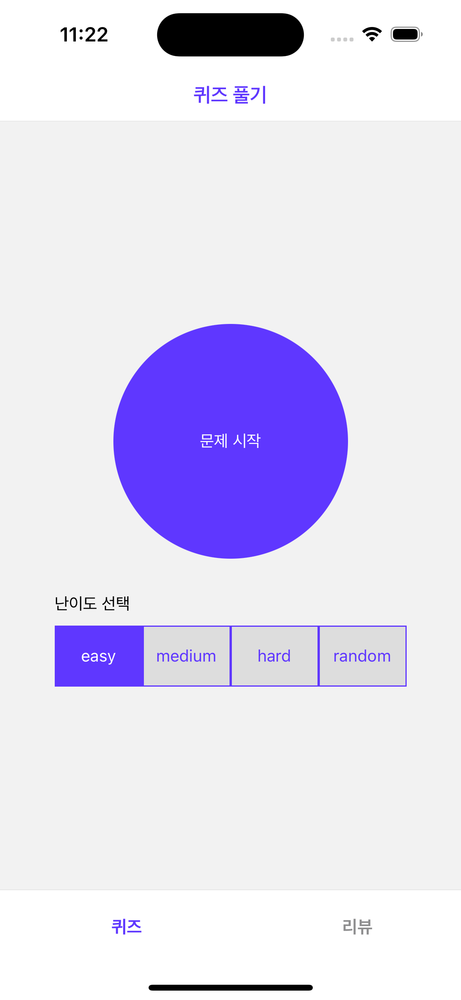
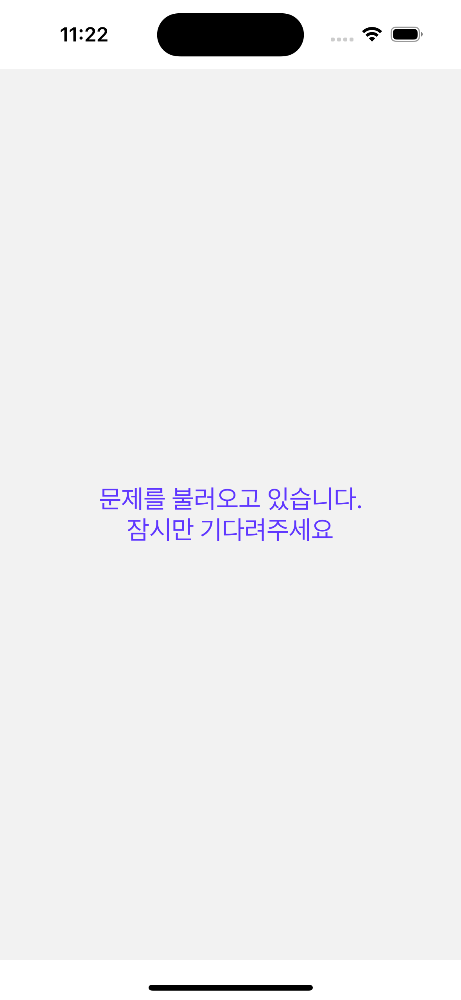

# QuizApp

퀴즈를 풀고 내가 푼 문제를 review 할 수 있는 간단한 react-native 앱입니다.

## Dev environment

> **Note**: Intel Macbook 에서 개발. (보유중인 Macbook 이 Intel 칩이라 Silicon Macbook 에서는 테스트 하지 못했습니다. 😭)

## Getting Started

### step 1 : 필요한 모듈을 초기화

```bash
yarn package:init  # node_module 삭제, 설치 및 cocoapod 설치 까지 할 수 있도록 설정

yarn package:init:clean # 필요시 cache 삭제 및 clean 이후 초기화
```

### Step 2: Metro Server 구동

```bash
yarn start
```

### Step 3: 테스트 앱 실행

### For Android

```bash
yarn android
```

### For iOS

```bash
yarn ios
```

## 주요 라이브러리

- typescript : type 설정을 위해 사용
- react-query : 상태 관리 및 api call 관리를 위해 사용
- react-navigation : 화면 이동 및 bottom-tab 을 위해 사용
- react-natve-firebase : 내가 푼 문제를 저장하기 위한 firestore 사용
- uuid : firestore 에 데이터 저장을 위한 id 생성을 위해 사용
- axios : api call 을 위해 사용
- testing-library : test 를 위해 사용

## 구현 사항

- 퀴즈 풀기

  - 퀴즈 난이도 설정 후 문제 시작 (난이도 : easy | medium | hard | random)
  - 퀴즈 진행 사항 progress bar 로 구현
  - 퀴즈 시작시 타이머 시작. 모든 문제 종료 후 타이머 종료
  - 퀴즈 난이도 뱃지로 표시
  - 답 선택 후 제출 버튼 클릭시 정답 확인 및 다음 문제로 버튼 출력
  - 모든 퀴즈 종료시 문제 및 결과를 firestore 에 저장하고 결과 화면 이동

- 리뷰
  - 내가 푼 문제들을 카드 형태로 출력
  - 카드에는 정답수 / 총 문항수 / 정답률 / 소요 시간 표시
  - 카드의 리뷰 버튼 클릭시 문제에 상세 보기 화면 전환
  - 상세 보기시 문제와 답안 / 정답 / 내가 선택한 답 을 볼 수 있음
  - 기본적으로 전체 문제 보기 지만 우측 상단에 '오답만 보기' 클릭시 틀린 문제만 표시
  - 리뷰 카드에서 다시 풀기 클릭시 해당 문제들을 다시 풀 수 있음. (다시 풀기 시 firestore 에 저장 하지 않음)

## 테스트

TDD 코딩은 처음이라 전체 코드를 coverage 하진 못했습니다.

### 테스트 실행

```bash
yarn test

yarn test --coverage
```

## Screen Capture

<p align="center">




</p>
